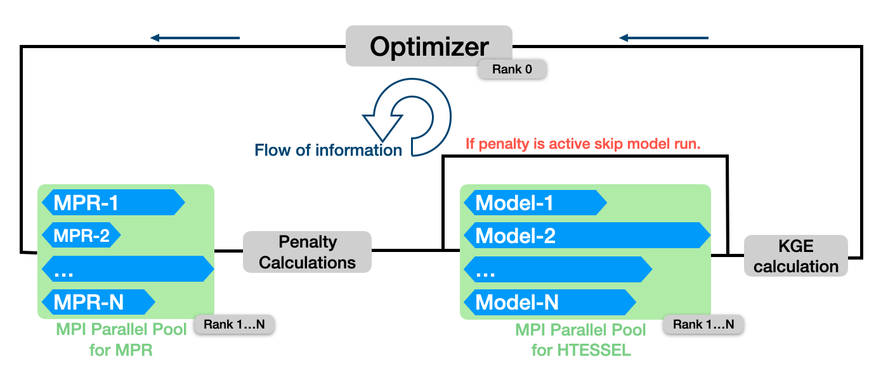

# Parameter calibration of HTESSEL land surface model



- Uses off the shelf [SPOTPY](https://spotpy.readthedocs.io/en/latest/) package for optimization. The inclusion of the package in this repository is because the DDS optimizer, which is used for optimization, did not have the restart capabilities. As a result, a modified version of SPOTPY is used to enable restarts in case of a crash of hitting the memory/time resources of the scheduler. The package is included as a whole since at the time publishing this work, installed git on the cluster did not support subtree. 
- Can optimize (as well as running cross validation) multiple basins simultaneously on multiple nodes of a cluster using `mpi4py`. Each basin must fit (memory-wise) on a single node. HTESSEL and MPR, the underlying programs used for computation, are not currently supporting MPI. 
- Developed to be used with SLURM Workload Manager but can be easily modified for other workload managers such as PBS. 
- Tested and can run on different compute clusters. More information on how to adapt this to a specific cluster is in the following documentation.

# How ro run the optimizer

Unless mentioned otherwise, all the scripts mentioned in this repository are placed at the root of `optim` package.

## Check paths

Each one of the files `htcal_path_{ecmwf,eve,juwels}.py` describe the path to all the files that are needed to build the simulations folder and insert appropriate symbolic links. Below each variable is described:

- `path_grdc_data`
- `path_grdc_alloc`
- `path_forcing`: Path to forcings for HTESSEL
- `path_misc`: Default input files for HTESSEL and CamaFlood
- `path_static`: Path to static files for HTESSEL
- `path_soilgrid`: Path to soilgrid files 
- `path_execs`: Path to executables of HTESSEL and MPR
- `path_pythonenv`: Path to virtual environment


## Modify `config.json`

Open the file `config.json` and change the `"cluster"` key to the relevant cluster name. For example, for the ECMWF cluster, the file is as follows:
```json
{
    "comment": "`cluster` is one of `eve`, `atos`, `juwels` or `ecmwf`",
    "cluster": "atos"
}
```

## Add virtual environment

Load openmpi and a recent python3 module and then install the virtual environment.

```bash
ml openmpi python3
python3 -m venv <PATH_TO_VENV_FOLDER>
source <PATH_TO_VENV_FOLDER/BIN/ACTIVATE>
```

After doing that, when successful, the name of the virtual environment appears in front of the command prompt. 

## Install required packages in the virtual environment

The python packages used in the optimizer scripts are in the file `requirements.txt` at the root of `optim` package. To install these packages in your virtual environment, type the following:

```bash
python3 -m pip install -r requirements.txt
```

## compile htessel and MPR 

this is the configuration for Atos HPC to compile htessel osm
```bash
prgenvswitchto gnu
module load gcc/8.4.1
module load ecmwf-toolbox
module load fcm
module load netcdf4/4.7.4
module load hdf5/1.10.6

export HDF5_DIR="/usr/local/apps/hdf5/1.10.6/GNU/8.4/"
export NETCDF_DIR=/usr/local/apps/netcdf4/4.7.4/GNU/8.4/
export GRIB_API_INCLUDE=$ECCODES_INCLUDE
export GRIB_API_LIB=$ECCODES_LIB

export OSM_COMP="gnu"
export OSM_BUILD="opt"
git clone ssh://git@git.<PATH>/ifs-source.git
cd ifs-source
fcm make -j 4 -vv -f ./surf/make/osm.cfg
cd -
# executable in ifs-source/osm/gnu-opt/build/bin/master1s.exe
```

and for MPR (see next chapter for paths)
```bash
[ ! -d ${mpr_dir} ] && git clone https://git.ufz.de/chs/MPR.git
cd MPR && git checkout develop
source <PATH_TO_VENV_FOLDER/BIN/ACTIVATE>
python -m src_python.pre_proc.update_tfs_in_fortran_source -c <PATH_TO_MPR_TF>/mpr.nml -p <PATH_TO_MPR_TF>/mpr_global_parameter.nml
# compile MPR
# optionally pass arguments here:
# -DGENERATE_TFS_CONFIG=${WORK_DIR}/${GRID_NAME}_run/00001/mpr.nml
# -DGENERATE_TFS_PARAM=${WORK_DIR}/${GRID_NAME}_run/00001/mpr_global_parameter.nml
cmake -B build
cmake --build build --parallel
cd -
# executable in MPR/build/MPR
```

## control file
For each optimization the user has to specify a python file as follows and save it where they want to run the optimization:

```python
mpr_tf = 'zacharias_res'

training = {
    '4145130': {'year_begin': 1979, 'year_end': 1981, 'warmup': 240},
    '5226800': {'year_begin': 1984, 'year_end': 1986, 'warmup': 240}
}


penalty = {
    'wsatm'  : {'lambda': -100.0, 'min': 0.35, 'max': 0.58},
}

params = \
    {
    'zach_thetas_1': [0.0, 1.0, 0.5],
	'zach_thetas_2': [-0.01, 0.01, 0.0],
	'zach_thetas_3': [-0.5, 0.5, 0.0],
	'zach_thetas_4': [0.0, 1.0, 0.5],
	'zach_thetas_5': [-0.01, 0.01, 0.0],
	'zach_thetas_6': [-0.5, 0.5, 0.0],
    }
```
- The file above is referred to as control-file in the rest of the document. 
- There several points to note about the `penalty` section:
  - Although not recommended, the `penalty` is optional and by not specifying it the optimizer will run both mpr and HTESSEL executables for each iteration, irrespective of range of the values computed by MPR.
  - The `penalty` section controls the range of values computed by MPR via a penalty cost function. Each key in the `penalty` section indicates a quantity that is computed by mpr. The key must be identical to the name found in `mprin` file.
  - Only specify keys in the penalty section that: A) have a transfer function and B) the parameters of the transfer function are being modified in the optimization loop (found int the `params` section). For the above example, the parameters of `wsatm` are modified during the optimization (`zach_thetas_{1..6}`) loop and we specify in the `penalty` section that `wsatm` to be confined to a range between `0.35` and `0.58`. A deviation from this range will cause the optimizer to return a large negative number, proportional to the number of violated cells, and the executation of the model is skipped. 
- Keyword `warmup` in the `training` is the number of days that is not being taken into account when calculating the KGE values.
- The keyword `'year_end'` in the `training` section is inclusive. The simulations are performed until the end of the year that is specified by this keyword.
- The first two numbers for each parameter indicate the lower and upper bounds for each parameter. The third value in each list is not used.
- The variable `mpr_tf` points to the folder name where an executable and nml files of a compiled MPR program are placed. Before specifying the value of this variable, make sure that these files exist in the path that is specified in `path_exec` variable under the same folder name. For the above example, assuming that `path_exec = /data/htcal/data/execs/`, I can see `mpr_tf` folder exists in `path_exec/mpr` and populated with the following files:
```bash
(_venv_) <USER> optim $ ls -ltr <PATH_TO_DATA>/execs/mpr/zacharias_res
total 3504
-rw-r-----+ 1 <USER> <GROUP>   82239 Mar 26  2021 mpr.nml
-rw-r-----+ 1 <USER> <GROUP>   25073 Mar 26  2021 mpr_global_parameter.nml
-rwxr-x---+ 1 <USER> <GROUP> 3454600 Mar 26  2021 MPR-0.6.7
```
- An executable of HTESSEL should exists in `path_exec`. Again using the above values, I can query that as follows:
```bash
(_venv_) <USER> optim $ ls -ltr /data/htcal/data/execs
total 10336
-rwxrwx---+  1 <USER> <GROUP> 5189488 Mar  2  2021 master1s.exe
drwxrws---+ 14 <USER> <GROUP>   16384 Oct 14  2021 mpr
```

## default simulation folders
Prepare the default simulations using the script `prepare_domains.py` as follows:
```bash
python <optimization_folder_path>/prepare_domains.py -l <optimization_folder_path>/basin_lut.org -c <control_file_path>/control.py 
```


## submit script
The following script is based on the above control file. It uses 3 nodes (one main node and two worer nodes) to run optimizer jobs in parallel. 
```bash
#!/usr/bin/bash

#SBATCH --ntasks=3
#SBATCH --time=10:00:00
#SBATCH --output=./LOG.run.%j.out
#SBATCH --error=./LOG.run.%j.err
#SBATCH --mem-per-cpu=6G
#SBATCH --export=ALL
#SBATCH --cpus-per-task=4
#SBATCH --job-name=test_mpi

# either OpenMPI or comparable library
ml openmpi python3

set -x
restart_option=""
while getopts ':r' 'OPTKEY'; do
    case ${OPTKEY} in
	'r')
            restart_option="-r"
            ;;
    esac
done


export OMPI_MCA_mpi_warn_on_fork=0
export OMP_NUM_THREADS=${SLURM_CPUS_PER_TASK}
# srun python -m mpi4py.futures ./driver1.py
srun python -m mpi4py.futures  \
         <PATH_TO_OPTIMIZER>/driver.py \
         -n 2000 \
         -c <PATH_TO_CONTROL_FILE>/control_file_multi_basin.py \
         $restart_option \
         -l <PATH_TO_OPTIMIZER>/basin_lut.org
```

Some of the parameters that require attention are described below:
- The number of iterations for the optimizer is specified using `-n` option in `driver.py` script.
- `--ntasks`: In order for all simulations to run simultaneously, this parameter should be equal to number of basins plus 1. So for the above control file, `--ntasks=3`. 
- `--mem-per-cpu` and `--cpus-per-task`: Has to be adjusted to allow the biggest job (among the specified basins in the control file) to run without running out of memory. Total memory allocated to each task is the amount of memory in `--mem-per-cpu` times the number of cpus specified for each task, `--cpus-per-task`. 
- In case we are interested in optimization of only one basin, in addition to specifyin only one basin in the control file, the submit script should be modified to `--ntasks=1`.

# Optimization results
Simulations for each iteration is stored in `runs` directory. Inside the `runs` directory, Each directory, named `sim_N`, where `N` refers to iteration number. The `runs` directory is created at the same location as the control file. At the root of the `runs` directory there exists a file called `res.txt`. Below we briefly describe this file and its content.
## Summary of optimization results (`res.txt`)
Pairs of (parameter set, error function values) are recorded in this file. Each line that begins with `parameters` is the beginning of a new iteration. The line that follows the parameter line is either the value of penalties, which indicates that for the selected set of parameters, penalty boundaries were violated and HTESSEL runs were skipped, or the result of successful HTESSEL run and therefore the average value of KGEs of the underlying basins. The following shows an example of an iteration that resulted in penalty boundaries violation, where the calculated `wsatm` parameter has exceeded its limits. These limits, both lower bound and upper bound, are specified in the control file under the `penalty` section.

```
parameters:  [0.6006745913982139, 0.0014574196981680995, -0.010837084179749573, 0.0739409034079411, -0.009512624968211867, -0.38419778063839277]
{'wsatm': -40.51884199552455, 'vgalpha': 0.0, 'nfac': 0.0}
```

When none of the penalty boundaries specified in the control are violated, the optimizer continues the optimization loop by calling the HTESSEL executable. After all the models are run, the optimizer calculates the KGEs of each basin and print the average KGE after its respective parameter set like the following:
```
parameters:  [0.6027889951836753, -0.00534684655301581, -0.010837084179749573, 2.25e-07, -0.004323149420012046, -0.38419778063839277]
[0.388577   0.62199874 0.64819235 0.79409507]
```

The first number in the KGE list is the average KGE and the following three numbers represent the components of (the average) KGE. For a detailed explanation of each term refer to the function `kge` under the file `postproc.py`.

## Global MPR using the results of optimization
In order to use the best parameter set for the global MPR runs, the following steps are recommended:
- Run the optimizer without `--clean-completed`. 
- Obtain the best iteration number from `res.txt` file.
- Copy the namelist from the respective simulation folder (of best results from previous step) and use it for global MPR simulations.

Below is the (partial) arrangement of iteration folders inside the `runs` directory:
```bash
ls -lrt |head
total 1038
-rw-r-----+ 1 <USER> <GROUP> 134261 Jun  9 18:33 res.txt
drwxr-x---+ 4 <USER> <GROUP>   4096 Jun  8 15:35 sim_1
drwxr-x---+ 4 <USER> <GROUP>   4096 Jun  8 15:38 sim_2
drwxr-x---+ 4 <USER> <GROUP>   4096 Jun  8 15:41 sim_3
drwxr-x---+ 4 <USER> <GROUP>   4096 Jun  8 15:43 sim_4
drwxr-x---+ 4 <USER> <GROUP>   4096 Jun  8 15:45 sim_5
drwxr-x---+ 4 <USER> <GROUP>   4096 Jun  8 15:48 sim_6
drwxr-x---+ 4 <USER> <GROUP>   4096 Jun  8 15:49 sim_7
drwxr-x---+ 4 <USER> <GROUP>   4096 Jun  8 15:52 sim_8
drwxr-x---+ 4 <USER> <GROUP>   4096 Jun  8 15:53 sim_9
```

## Cross Validation 
For cross validation, one can use the `cv_multi.py` script. The script requires a json file that specifies the stations that should be used for cross validation. This file is fed to the script using `--cv-stations` option. The json file contains keys with the name of the stations as well as the starting year for each station and duration of simulation for each station. An example would look like this:

```json
{
    "station_5225600": {
        "nyrs": [
            7
        ],
        "yb": [
            1988
        ],
    },
    "station_6985350": {
        "nyrs": [
            8
        ],
        "yb": [
            1979
        ],
    }
}
```

where `yb` is the (year of) start of simulation and `nyrs` specificies the length of the simulation in years. An example of a submit script, to run the cross validations using `cv_multi.py` for Eve looks like the following:

```bash
#!/usr/bin/bash

#SBATCH --nodes=16
#SBATCH --ntasks=16
#SBATCH --time=04:00:00
#SBATCH --output=./LOG.run.%j.out
#SBATCH --error=./LOG.run.%j.err
#SBATCH --mem-per-cpu=20G
#SBATCH --export=ALL
#SBATCH --cpus-per-task=4
#SBATCH --job-name=cv_mpi
#SBATCH --wait-all-nodes=1


# either OpenMPI or comparable library
ml OpenMPI

set -x


export OMPI_MCA_mpi_warn_on_fork=0
export OMP_NUM_THREADS=${SLURM_CPUS_PER_TASK}

srun python -m mpi4py.futures <PATH_TO_OPTIM_CODE>/cv_multi.py \
     -c <PATH_TO_CONTORL_FILE>/control_file.py \
     --cv-folder-path <PATH_TO_CV_FOLDER>/ \
     --cv-stations <PATH>/stations.json \
     -l <PATH>/basin_lut.org \
     --warmup 365 \
```

The script first extracts the best kge and its corresponding parameter set from `res.txt`, and writes this information in `best_param_set.json`. Using this parameter set, the script runs forward runs of all the stations specified in the json file `stations.json`. After all forward runs are done, the user can extract the kges of the validation set using `kge_multiyear.py` and a bash script like this one: 

```bash
for mb in "."; # loop on CV folders
do
    rm -f $mb/CV/kges.txt && touch $mb/CV/kges.txt
    # for st in $(\ls $mb/CV/ | grep station_ | tail -n2);
    for st in $(\ls $mb/CV/ | grep station_);
    do
        echo -n "${st} " >> $mb/CV/kges.txt
        python $kge_script_path \
               -p $mb/CV/$st/default_sim/$st \
               -w 365 \
               -n $(echo $st | perl -ne '/.+_(\d+)/; print $1') \
               >> $mb/CV/kges.txt
    done
done
```

## Misc
- When calling the `driver.py`, if option `--clean-completed` is specified, the simulation folders for each iteration are removed after successful completion of each iteration. 
- An incomplete optimization process (which is ended due to time limit) can be restarted by specifying `-r` when calling the `driver.py`. The optimization is resumed by using the best validation set so far as a starting point. 

